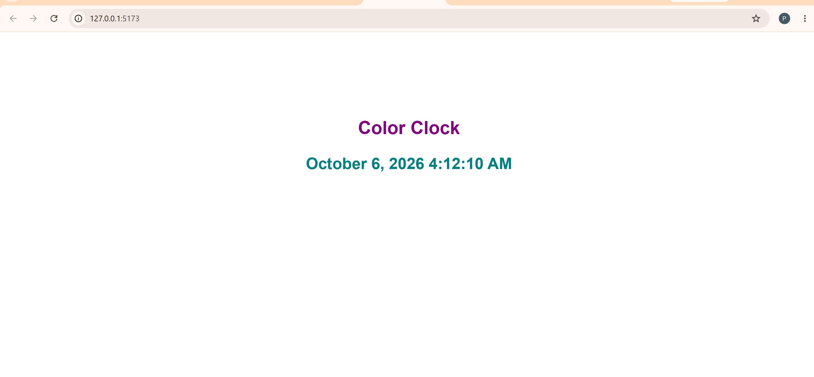

# Color Clock

A simple React application that displays the current date and time using the `date-fns` package.

## Features

- Displays the current date and time
- Uses React and JSX
- Uses `date-fns` to format the date and time
- Includes simple color styling

## Technologies Used

- React
- Vite
- JavaScript
- npm
- date-fns

## How to Run the Project Locally

1. Clone the repository.

2. Navigate into the project folder:

```bash
cd color-clock
```

3. Install the dependencies:

```bash
npm install
```

4. Install the `date-fns` dependency if needed:

```bash
npm install date-fns@2.30.0
```

5. Start the development server:

```bash
npm run dev
```

6. Open the localhost URL provided by Vite in your browser.

Example:

```text
http://localhost:5173/
```

## Project Structure

```text
color-clock/
├── index.html
├── package.json
├── README.md
└── src/
    ├── App.jsx
    └── main.jsx
```

## How the Application Works

The `index.html` file contains the root element where the React application is displayed.

The `main.jsx` file connects React to the root element and renders the `App` component.

The `App.jsx` file contains the main clock component. It uses JavaScript's `new Date()` to get the current date and time and the `format()` function from `date-fns` to display it in a readable format.

Example:

```jsx
format(new Date(), 'MMMM d, yyyy h:mm:ss a')
```

The application also includes simple inline styling to add color and improve the appearance of the clock.

## Dependency

This project uses `date-fns` for date and time formatting.

```bash
npm install date-fns@2.30.0
```

## Screenshot

.

## Author

Perpetua Ayogu